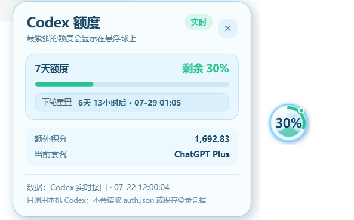
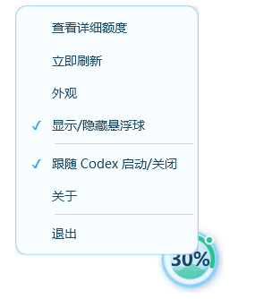
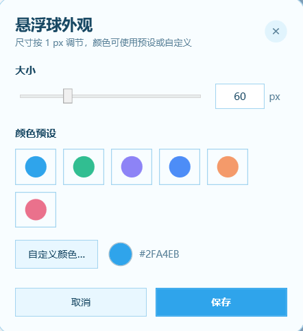

# TokenOrb v1.2

Token Orb 是一个实时监控codex剩余额度的悬浮球小软件。

### MSI 安装（推荐）

1. 从右侧release发布的安装包中选择 `TokenOrb.msi` 进行安装。
2. 启动 Token Orb。
3. Token Orb 会在 Codex 桌面应用启动时出现，并在 Codex 关闭后退出悬浮球界面。

### 界面预览
#### 1. 悬浮球

#### 2. 监控界面

#### 3. 右键悬浮球菜单

#### 4. 自定义悬浮球外观

## 功能

- **跟随 Codex 启动/关闭**
- **实时监控Codex额度、订阅套餐类型、下轮刷新时间**
- **自定义悬浮球颜色**
- **显示/隐藏悬浮球**

## 系统要求

- Windows 10 或 Windows 11
- 已安装并登录 Codex 桌面应用；关闭跟随功能后，也可仅配合 Codex CLI 使用
- Windows 自带 .NET Framework 4.x

