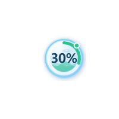
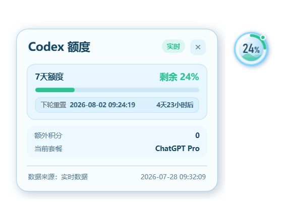
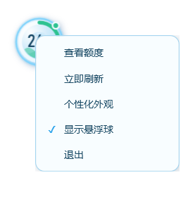
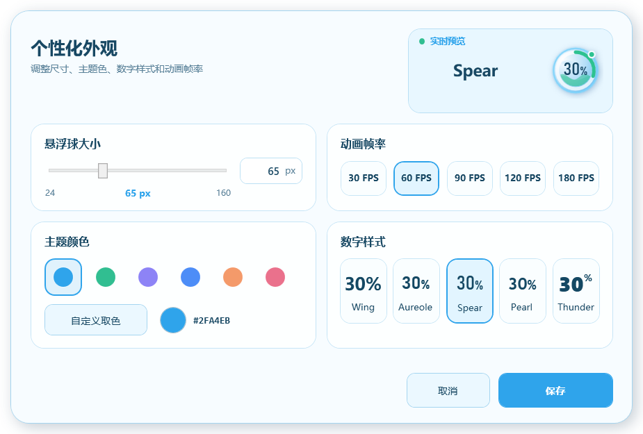

# TokenOrb v1.5.1

Token Orb 是一个实时监控codex剩余额度的悬浮球小软件。

## Windows 安装

1. 从右侧 Release 下载 `TokenOrb-Windows.msi`（推荐）进行安装，也可直接运行免安装的 `TokenOrb-Windows.exe`。
2. 启动 Token Orb。
3. Token Orb 会在 Codex 桌面应用启动时出现，并在 Codex 关闭后退出悬浮球界面。

## macOS 安装

1. 从右侧 Release 下载并打开 `TokenOrb-macOS.dmg`。
2. 将 `Token Orb.app` 拖入“Applications”后启动。
3. 当前安装包使用 ad-hoc 签名、尚未公证；若 macOS 提示无法验证开发者，请在 Finder 中按住 Control 点击应用并选择“打开”。

macOS 客户端支持 Apple Silicon 与 Intel、菜单栏、桌面悬浮球、实时额度、外观设置、账号切换重连和跟随 Codex 启动/关闭。

## 界面预览
#### 1. 悬浮球

#### 2. 监控界面

#### 3. 右键悬浮球菜单

#### 4. 自定义悬浮球外观

## 功能

- **跟随 Codex 启动/关闭**
- **实时监控Codex额度、订阅套餐类型、下轮刷新时间**
- **切换 Codex 账号后自动重连并刷新当前账号额度**
- **自定义悬浮球颜色**
- **显示/隐藏悬浮球**

## 系统要求

- Windows 10 / 11，或 macOS 13 及更新版本
- 已安装并登录 Codex 桌面应用；关闭跟随功能后，也可仅配合 Codex CLI 使用
- Windows 版本需要系统自带的 .NET Framework 4.x
- 从源码构建 macOS 版本需要 Apple Command Line Tools
